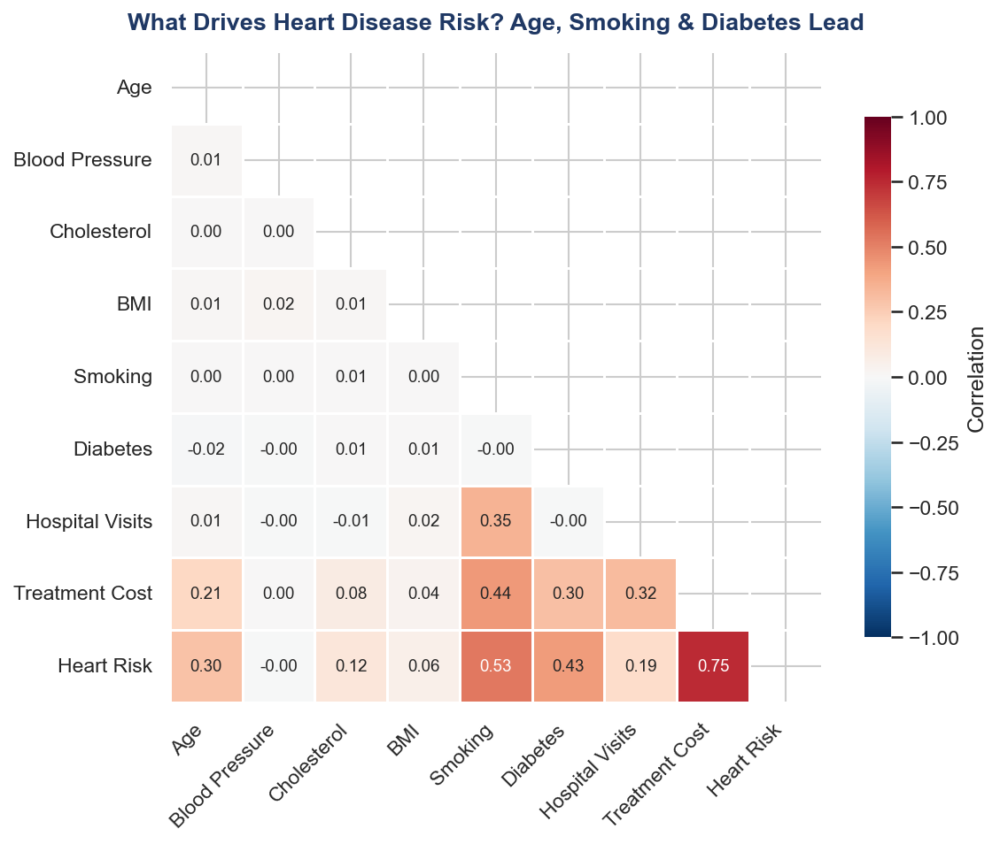
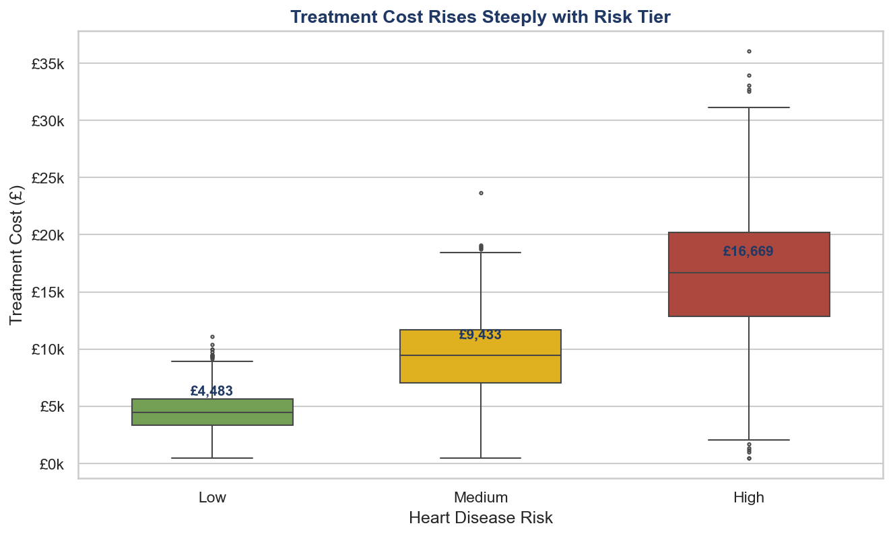
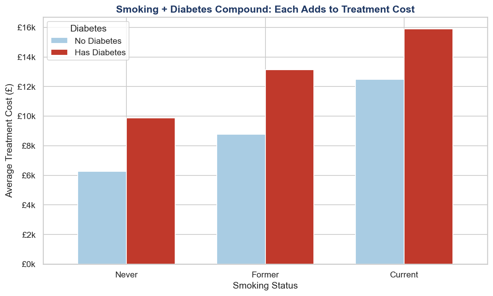

# 🏥 Heart Disease Risk & Hospital Cost Analysis

### An end-to-end data analytics project — Data Cleaning · Excel · SQL · Python · Power BI

> *Understanding the Key Drivers of Heart Disease Risk and Hospital Costs in a Patient Population*

---

## 📌 Project Overview

This project analyses **10,000 patient records** from a simulated hospital environment (St. Martin's General) to answer a question posed by the (fictional) Chief Medical Officer and Finance Director:

> *"What drives heart disease risk, and where are our treatment costs concentrated — so we can intervene effectively?"*

The analysis follows a complete, realistic data workflow — from messy raw data through to an interactive executive dashboard — using five tools that mirror a professional Business Intelligence stack.

---

## 🎯 Key Findings

| Finding | Insight |
|---|---|
| 💷 **£94.5M** total treatment spend across 10,000 patients | The dataset represents significant budget exposure |
| ⚠️ **High-risk patients = 24% of population but 41% of all spend** | Cost is highly concentrated, not evenly spread |
| 📈 **3.7× cost gradient** | High-risk patients cost a median £16,669 vs £4,483 for low-risk |
| 🚬 **Smoking (0.53) & Diabetes (0.43)** are the strongest risk correlates | Behavioural and condition-based factors dominate |
| 🎯 **Target cohort: diabetic smokers over 60** — just 2.3% of patients, 1.7× average cost | A small, targetable group offers outsized savings potential |
| 🔬 **Compound effect**: diabetic current-smokers cost 2.5× more than non-diabetic never-smokers | Risk factors stack rather than simply add |

**Strategic recommendation:** A focused preventive intervention targeting the ~233 highest-value patients (diabetic smokers over 60) addresses the most expensive cohort in the hospital — a far more cost-effective strategy than broad, population-wide programmes.

---

## 🛠️ Tools & Skills Demonstrated

| Phase | Tool | Skills |
|---|---|---|
| **1. Data Cleaning** | Python (pandas) | Handling nulls, duplicates, outliers, inconsistent formatting, type conversion |
| **2. Exploratory Analysis** | Excel | Pivot tables, slicers, interactive dashboard, conditional formatting |
| **3. Data Querying** | SQL (SQL Server / T-SQL) | Filtering, aggregation, `CASE` segmentation, **CTEs**, **window functions** |
| **4. Statistical EDA** | Python (matplotlib, seaborn) | Distribution analysis, correlation heatmaps, box plots, data storytelling |
| **5. BI Dashboard** | Power BI | DAX measures, data modelling, 3-page interactive report, slicers |
| **6. Version Control** | Git / GitHub | Repo structure, documentation, commit hygiene |

---

## 📊 Visual Highlights

### Correlation: What Drives Risk?


### Treatment Cost Rises Steeply with Risk Tier


### Smoking + Diabetes Compound on Cost


---

## 📁 Repository Structure

```
heart-disease-cost-analysis/
│
├── README.md                          # You are here
│
├── data/
│   ├── st_martins_hospital_raw.csv        # Original messy dataset
│   └── st_martins_hospital_cleaned.csv    # Cleaned, analysis-ready dataset
│
├── python/
│   ├── 01_data_cleaning.py            # Phase 1: cleaning pipeline
│   └── 04_python_eda.py              # Phase 4: EDA & visualisations
│
├── sql/
│   └── clinical_queries.sql          # Phase 3: progressive SQL analysis
│
├── excel/
│   └── st_martins_hospital_dashboard.xlsx   # Phase 2: interactive Excel dashboard
│
├── powerbi/
│   └── st_martins_hospital_report.pbix      # Phase 5: 3-page Power BI report
│
└── visuals/
    ├── fig1_cost_distribution.png
    ├── fig2_correlation_heatmap.png
    ├── fig3_cost_by_risk.png
    ├── fig4_age_by_risk.png
    └── fig5_smoking_diabetes_cost.png
```

---

## 🔍 Methodology

### Phase 1 — Data Cleaning
The raw dataset was deliberately messy (mirroring real-world data merged from multiple clinic systems): duplicate records, inconsistent categorical labels (`Male`/`M`/`MALE`), mixed-type numeric fields (`"152 mmHg"`, `"£8,500"`), physiologically impossible outliers, and invalid values (negative hospital visits). A pandas pipeline standardised formats, removed 200 duplicates, capped outliers, and corrected data types — improving the dataset from unusable to analysis-ready.

### Phase 2 — Excel Analysis
An interactive dashboard with slicer-driven pivot tables explored the first-pass patterns: risk by age, cost by gender, resource use by smoking status.

### Phase 3 — SQL Analysis
Progressive T-SQL queries answered cohort-level financial questions, culminating in a CTE + `ROW_NUMBER()` window function ranking the costliest patients within each risk tier.

### Phase 4 — Python EDA
Statistical visualisation revealed the *shape* of the data — the right-skewed cost distribution, the correlation structure of risk drivers, and the compounding effect of smoking and diabetes.

### Phase 5 — Power BI
A three-page interactive report (Overview · Patient Risk Analysis · Cost Breakdown) with custom DAX measures brought the full story together for stakeholder self-service.

---

## ⚠️ Limitations & Assumptions

This project uses **synthetic data** generated for demonstration purposes. As such:

- The relationships between variables were programmatically defined. In this dataset, **blood pressure, BMI, and cholesterol show near-zero correlation** with heart disease risk — which differs from real clinical evidence, where these are established factors. This is a property of the synthetic generation, and a real analysis would expect different correlations.
- **"Readmission"** is approximated using a proxy (patients with 3+ hospital visits), as the dataset does not track time-windowed repeat admissions.
- Findings are illustrative of analytical technique and storytelling, not clinical conclusions.

Documenting these assumptions reflects the analytical transparency expected in professional BI work.

---

## 🚀 How to Reproduce

1. Clone this repository
   ```bash
   git clone https://github.com/YOUR_USERNAME/heart-disease-cost-analysis.git
   cd heart-disease-cost-analysis
   ```
2. Install Python dependencies
   ```bash
   pip install pandas numpy matplotlib seaborn
   ```
3. Run the cleaning pipeline, then the EDA
   ```bash
   python python/01_data_cleaning.py
   python python/04_python_eda.py
   ```
4. Open the SQL file in SQL Server Management Studio, the `.xlsx` in Excel, and the `.pbix` in Power BI Desktop to explore the dashboards.

---

## 👤 Author

**Jennifer Iwunze**
Data Analyst — Business Intelligence, Reporting & Insights
📧 iwunzedeeva@gmail.com · 🔗 [LinkedIn](https://www.linkedin.com/in/iwunze-jennifer)

---

*This project was built as a portfolio piece demonstrating an end-to-end analytics workflow across the modern BI stack.*
